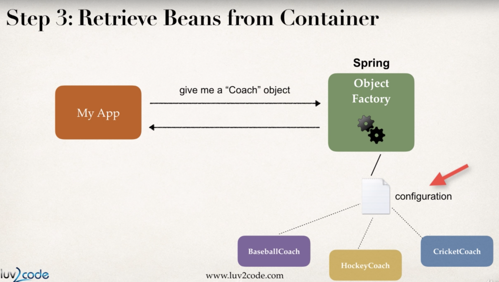
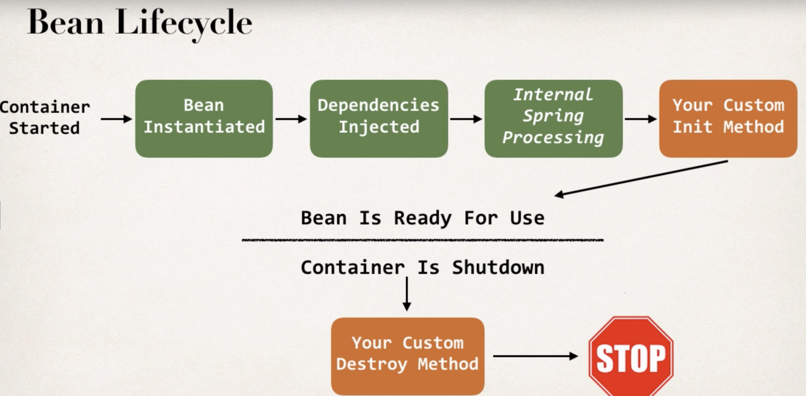

# Spring framwork

## Spring container

- Primary function
  - create and manage objects(Inversion of Control)
  - Inject object's dependencies(Dependency injection)

- create spring container
  - applicationcontext
  - 

## Bean
- What's a sprint bean
  - A "Spring Bean" is simply a Java object.
		When Java objects are created by the Spring Container, then Spring refers to them as "Spring Beans".
		Spring Beans are created from normal Java classes .... just like Java objects.
  - In Spring, the objects that form the backbone of your application and that are managed by the Spring IoC container are called beans. A bean is an object that is instantiated, assembled, and otherwise managed by a Spring IoC container. Otherwise, a bean is simply one of many objects in your application. Beans, and the dependencies among them, are reflected in the configuration metadata used by a container.

- Bean scope
  - singleton
  - prototype

- Bean Lifecycle
  - 